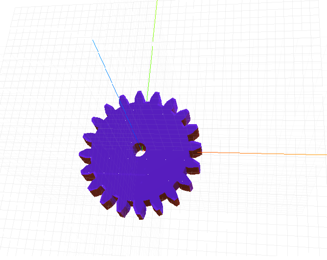

# craft-gear
Parameterized gear

## Install:

    $ npm install craft-gear

## Parameters:

**numTeeth:** To adjust the number of teeth of the gear

**circularPitch:**To adjust radius of the gear

**pressureAngle:** To adjust pressure angle of teeth of the gear that is the angle between the tooth face and gear wheel tangent.

**clearance:** To adjust the clearance or gap of teeth in the gear

**thickness:** To adjust height or thickness of gear

**centerholeradius:** To adjust radius of the center hole of the gear

